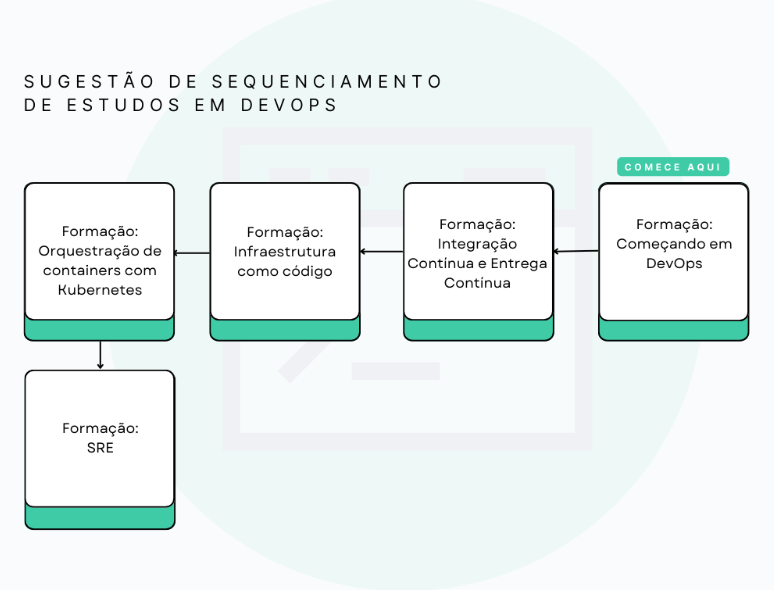

# Integração Contínua e Entrega Contínua

<h3>O QUE É ENTREGA CONTÍNUA (CONTINUOUS DELIVERY/ CD)?</h3>

A Entrega Contínua é uma disciplina de desenvolvimento de software em que você cria software de forma que ele possa ser colocado em produção a qualquer momento usando automação e ciclos curtos de entrega.

<b>Segundo <a href='https://martinfowler.com/bliki/ContinuousDelivery.html'>Martin Fowler</a> você está fazendo entrega contínua quando:</b> 
<li>Você pode fazer deploy do seu software durante todo o ciclo de vida;
<li>Sua equipe prioriza manter o software pronto para deploy em vez de trabalhar em novas funcionalidade;
<li>Qualquer pessoa pode obter feedback rápido e automatizado sobre quão pronto para entrar em de produção seus sistemas estão, sempre que alguém fizer uma alteração neles;
<li>Você pode fazer deploy de qualquer versão do software para qualquer ambiente sob demanda simplesmente apertando um botão.

<h3>O QUE VOCÊ VAI APRENDER NESSA FORMAÇÃO?</h3>
<li>Você criará sua primeira rotina de integração contínua para automatizar parte das tarefas do seu dia a dia ao desenvolver uma aplicação.
<li>Você vai aprender o que é pipeline, a trabalhar com branches e a fazer rollback.
<li>Você vai usar o Github Actions.
<li>Você vai aprender a criar containers Docker e rodar testes automaticamente.
<li>Vai fazer entrega contínua usando Cloud.
 
 

