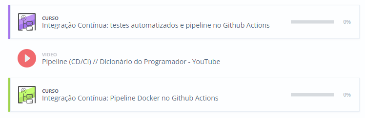
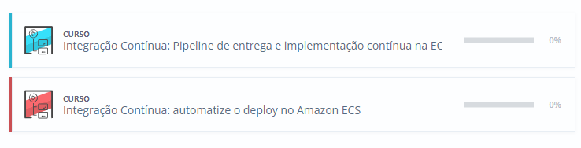
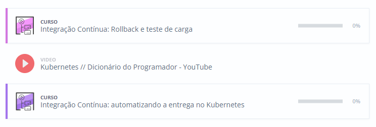

# Passo a passo
<h2>1. Criando uma rotina de CI</h2>

> Neste primeiro passo você vai aprender a criar uma rotina de Integração Contínua (e vai descobrir as vantagens de ter uma rotina de CI) e configura-lá para executar a cada novo commit.  

> Em seguida, vai aprender a executar testes, independentemente da fase de desenvolvimento, no Github Actions.

> E por fim, você vai aprender a organizar uma rotina de integração contínua, criar containers Dockerautomaticamente e fazer testes em uma aplicação de forma automática.

<h2>2. Começando com entrega contínua</h2>

> Neste passo você aprenderá o que é entrega contínua e irá trabalhar com pipelines e containers, colocando a sua aplicação em máquinas virtuais da Amazon e Elastic Container Service.

<h2>3.Garantindo a aplicação e Kubernetes</h2>

> Nesse ultimo passo você aprenderá a realizar testes na aplicação dentro da infraestrutura e garantir a sua execução para prevenir falhas e tempo fora do ar. Também colocará sua aplicação dentro de um cluster do Kubernetes e disponibilizara ela para outras pessoas acessarem através de um balanceador de carga, garantindo que as requisições sejam respondidas o mais rápido possível.

