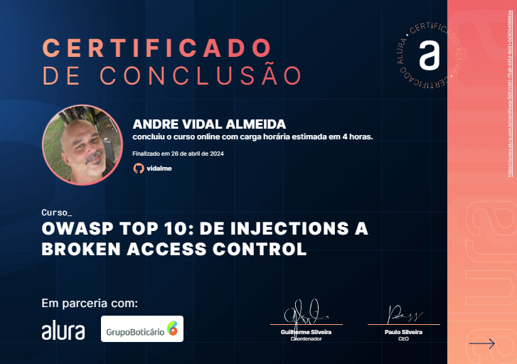

# OWASP Top 10: de Injections a Broken Access Control

<li>OWASP Top Ten e Injection Ver primeiro vídeo
<li>A2 Broken Authentication
<li>A3 Sensitive Data Exposure
<li>A4 XML External Entities
<li>A5 Broken Access Control
 
 

