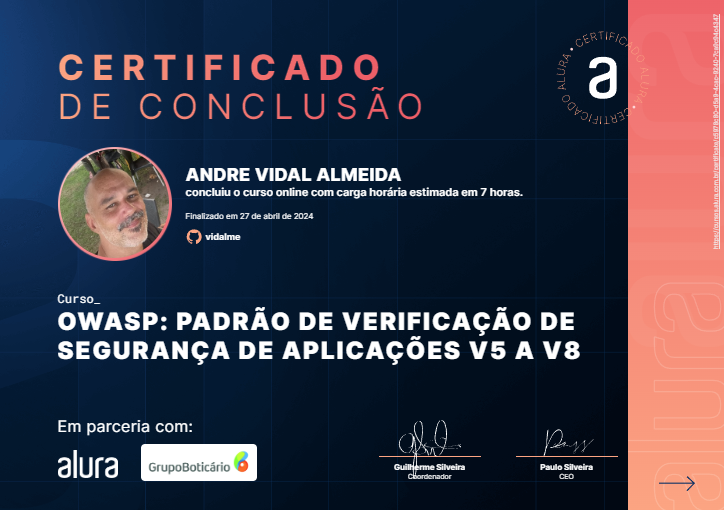

# OWASP: padrão de verificação de segurança de aplicações V5 a V8

<li>Validation, Sanitization and Enconding Verification Requirements
<li>Mais requerimentos prevenindo Injection
<li>Stored Cryptography Verificationb Requirements
<li>Error Handling and Logging Verification Requirements
<li>Data Protection Verification Requirements

 
 

