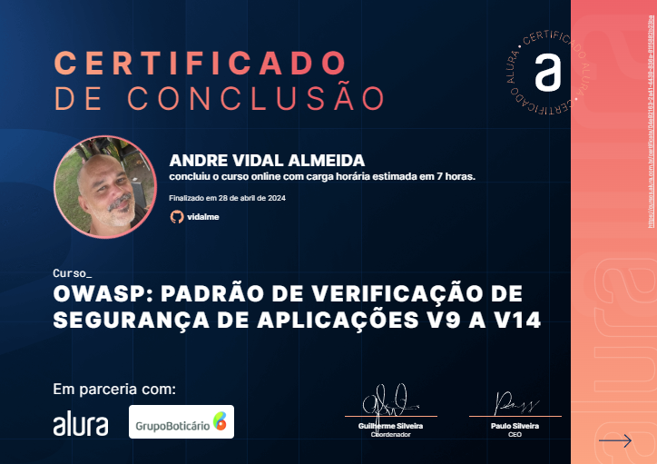

# OWASP: padrão de verificação de segurança de aplicações V9 a V14

<li>Communications Requirements 
<li>Malicious Code Verification Requirements
<li>Business Logic Requirements
<li>File and Resources Verification Requirements
<li>API and Web Service Verification Requirements
<li>Configuration Verification Requirements

 
 

