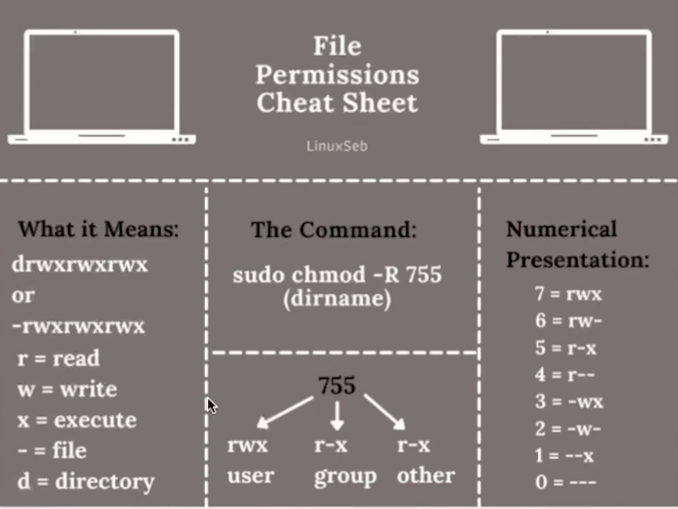

## Linux Onboarding: trabalhe com usuários, permissões e dispositivos

## Administrando usuários e grupos

<b>useradd</b> -> adiciona um novo usuario porem de forma bbem seca mas com muita flexibilidade para ser usado em scripts<br>
<b>adduser</b> -> É um script que ja cria o usuario e adiciona e populaciona varias outras coisas ao mesmo tempo<br>

Cria groups proejtos
```
sudo groupadd projetos
```

O comando abaixo muda configs do usuario, as flags -a é para acrescentar e o -G maiusculo é alterar o grupo secundario do usuario (se usar o g minusculo tenta mudar o grupo primario, vai dar bug mais na frente)
```
sudo usermod -aG projetos andre3
```
<b>userdel</b> - delete usuario<br>
<b>groupdel</b> - delete grupo<br>

## Por dentro dos permissionamentos
Vou so colocar a imagem com o cheat sheet, meio com preguiça de anotar esse assunto que eu já domino.


Para mudar as permissoes de um diretorio ou arquivo
```
sudo chmod 770 "aquivo ou diretorio"
```

Mudar o usuario e o group donos de um arquivo ou diretorio
```
sudo chown andre:projetos /projetos
```
Criação de links simbolicos
```
ln -s /projetos projetos
```

## Gerenciamento de pacotes
```
sudo apt update
sudo apt install apache2
```

<li>Utilizando o apt e o apt-cache
<li>Como localizar pacotes no repositório com apt list
<li>Fazendo o upgrade dos pacotes
<li>Utilizando o apt show para detalhar as informações dos pacotes
<li>Consultando os pacotes instalados com o apt list --installed

## Gerenciamentos de discos

<li>Adicionando dispositivos de disco no sistema
<li>Particionando o disco
<li>Instalando o File System ext4
<li>Montando o disco
<li>Configurando o /etc/fstab

## Systemd - Gerenciando os serviços

<li>Systemd e outro gerenciadores
<li>Gerenciando os daemon (start, stop, status)
<li>Utilizando as ferramentas systemctl e service
<li>Configurando serviços de forma automática (inicialização do sistema)