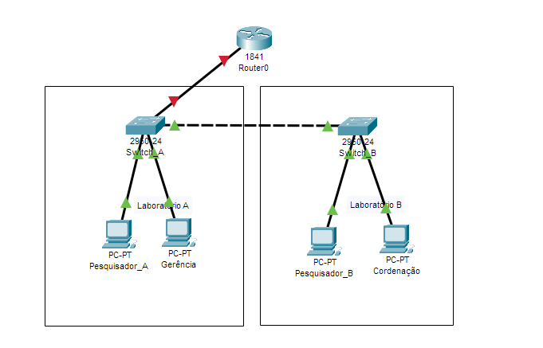

<h2>Redes locais virtuais (VLANs)</h2> 

<li>Criando redes locais (LANs)
<li>diferenças entre LAN, MAN e WAN
<li>Construindo redes locais virtuais (VLANS)
<li>Protocolo DTP x Modo de operação das portas do switch
<li>Conectando VLANS
<li>Roteamento/subinterfaces
 
 

