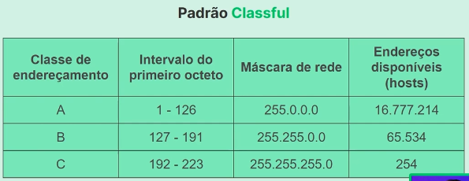
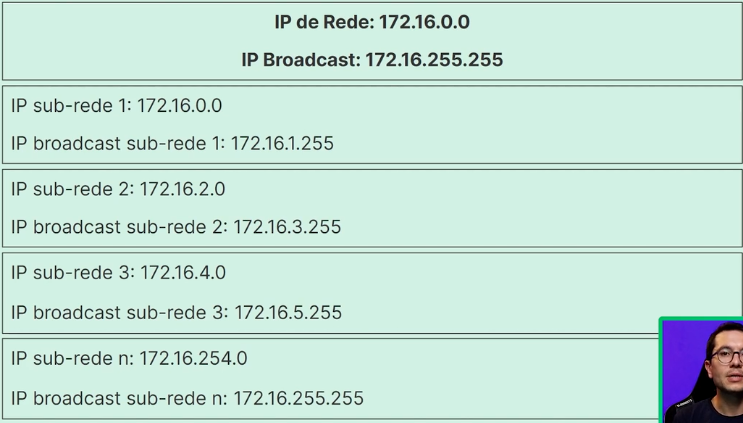

<h1>Configurando subredes de modo eficiente</h1> 

<h3>Redundância de links com STP</h3>

Essa redundancia é necessaria para mantermos uma rede mais segura e confiavel. O problema que quando criamos uma rede que evita single point of failures, ela fica sujeit a sofrer com dados presos em consequencia de seus TTLs que sao consumidos apenas por routers e não por switches. O risco é que esses dados fiquem em loop eterno consumindo nossos recursos de rede.

<b>Importância do STP</b> 
 A solução para esse problema é a criação de uma hierarquia nos switches, eles se organizam conversando entre si com o protocolo STP (spanning tree protocol), eles criam uma tabela e elegem o mais rapido e mais lento, onde o mais rapido sera responsavel pelo gerenciamento dessa micro pseudo-sub-rede de switches e o mais lento ira ser a conexão que elimina pacotes redundantes em loop eterno.

O STP deixa os links redundante inativos ate que algum link falhe, e so assim as redundancias sao ativadas, evitando assim os loops redundantes. 

<h3>Análise de endereços IP</h3>

No nosso projeto de planejamento iremos rodar 600 maquinas, então precisamos de mais de uma mascara maior que apenas o ultimo octeto do IP aberto, ou seja a parte do IP destinada a identificar a rede são os 3 primeiros octetos e apenas a ultimo octeto destinado a identificar o host, então a classe C de IPs não nos atenderia, precisamos expandir para a classe B, que disponibiliza endereços IP com sub-mask 255.255.0.0 (mais de 60mil endereços)

<h3>Distribuição eficiente de endereços IP</h3>

Endereços de IPs são limitados e regulados por agencias de comunicação do pais, precisam ser usados de forma eficiente, ai levanta a questão, precisamos de 600 endereços, um IP range de submask 255.255.255.0 é muito pequena pois so contem 254 endereços, o proximo passo seria uma submask 255.255.0.0, mas ai são 60 mil end IPs disponiveis, seria um grande desperdicio.

Para solucionar isso usamos o padrão classless de distribuição, que nos permite quebrar essas submasks em valores intermediarios, como
255.255.254.0 ou em CIDR algo como 192.168.10.0/23 

<h3>Configurando as sub-redes</h3>

Com o uso das Mascaras de rede ajustadas podemos nos aproximar muito do numero exato que necessitamos de endereços IPs, durante a aula vimos a matematica e como calcular. Resuimndo precisamos analisar o IP em forma de binarios, por exemplo uma mascara 255.255.255.0 é o equivalente a 11111111.11111111.11111111.00000000 (sao 8 bits para representar todos os numeros de 0 a 255, por isso são chamados octetos). Cada um desses bits tem seu valor de converão para numeros regulares baseado em sua posição, ou seja o ultimo binario do octeto tem um valor de 2 na eventual soma. 

Enquanto escrevo eu entendo, porem dificilmente vou conseguir reler isso e entender. O que importa é pensar e elaborar as ideias na cabeça para melhor compreensão do assunto.

