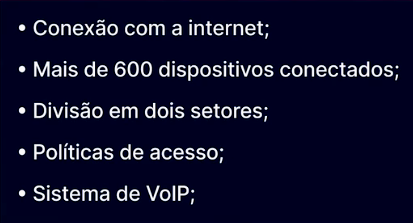
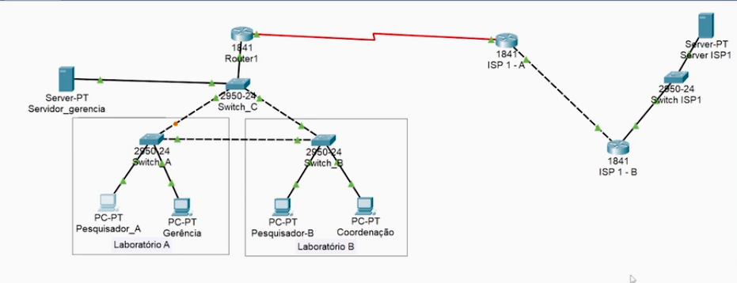
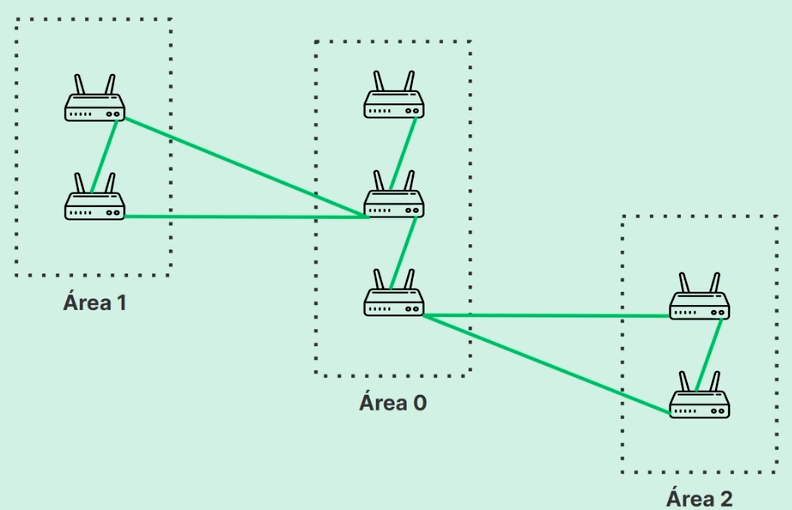

<h2>Roteamento interno</h2> 
<h3>Projeto inicial para o curso</h3>

Continuamos trabalhando em cima do mesmo projeto com as caracteristicas abaixo.

<h3>Como ocorre o roteamento?</h3>

 Para realmente podermos entender como funciona, criamos um servidos mais distante no projeto, com mais um outro roteador de uma ISP no meio do caminho, que conecta no seu proprio roteador outra rede e la com seu switch e finalmente outro servidor, esse exemplo assim fica mais realista com o que realmente acontece na internet. Fizemos varias configurações no packet tracer.
<h3>Entendendo o protocolo RIP</h3>

Apos uam breve configuracao extra para podermos ter nossa comunicacao entre pesquisador-A e servidor ISP-1

Usando o protocol RIP é simple porem limitado, pois o criterio que ele utiliza para decidir a melhor rota é apenas baseado no numero de routers entre ele e o destino, não interessa a latencia ou badnwitch da conexao, assim podendo acabar em uma conexao lenta por cnota que seria mais proxima em numero de hops (routers)

<h3>OSPF: selecionando o melhor caminho</h3>

OSPF - open short path first, é o protocol que supera o RIP pois procura o melhor/mais rapido caminho entre user e server. Ele usa algumas estrategias, uma delas são routers especiais que são extra potentes que guardam informaçoes sobre outros routes da sua viznhanca proxima, assim podendo fazer decisões de roteamento mais inteligente e baseadas em informção que ele contem.

OSPF calcula a velocidade de cada rota e associa a elas um custo, quanto menor o custo, melhor e mais rapida é a rota, que sera a escolhida.
<!--
Apresentação
O processo de roteamento de pacotes
Faça como eu fiz: ampliando a rede do provedor de serviços 1 (ISP - 1)
Algoritmo de vetor de distância
Faça como eu fiz: configurando o protocolo RIP
Faça como eu fiz: construindo a rede de um novo provedor de serviços (ISP - 2)
Configurando o protocolo OSPF
Roteamento de redes
Faça como eu fiz: configurando o protocolo OSPF
Hora da prática
O que aprendemos?
-->