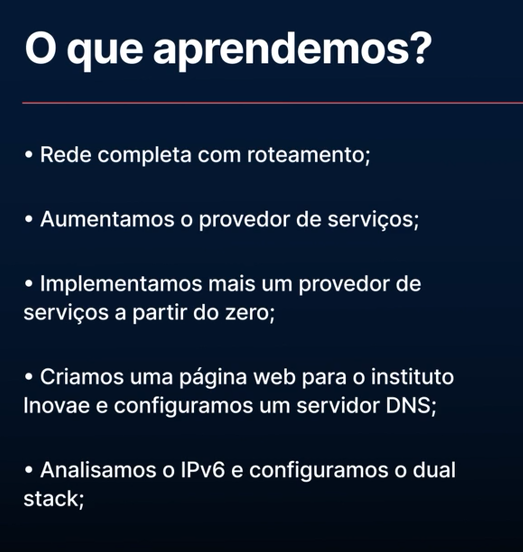

# Redes: implementando roteamento, DNS e IPv6

<li>Faça o processo de roteamento em redes de computadores
<li>Aplique protocolos de roteamento como BGP, OSPF e RIP
<li>Configure o sistema DNS e entenda seu funcionamento
<li>Implemente um servidor DNS
<li>Explore as principais características do IPv6
<li>Configure uma rede de computadores com IPv6

