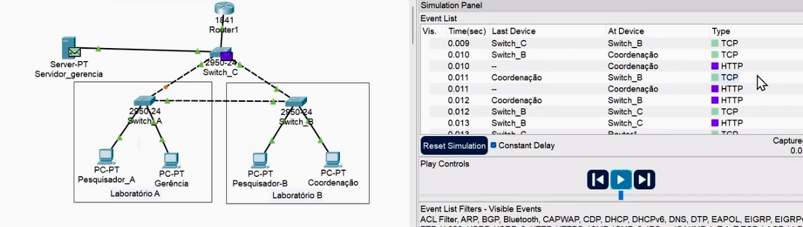

<h1>Tráfego de rede</h1> 

<h3>Protocolos TCP e UDP</h3>

Uma dos requerimentos do nosso projeto é a criação de um servidor com informações que só professores e administração tera acesso. Para isso criamos um servidor na nossa rede com conectado ao switch, configuramos uma nova vlan para essa rede para aumentarmos a separação dela. Tambem foi criado dentro do roteador uma subinterface para o controle desse desse trafego das vlans,

Agora apenas os computadores inclusos nessa vlan tem o acesso ao servidor destinado, a comunicação usa os protocolos TCP e UDP para permitir a troca de pacotes via HTTP.

TCP estabelece uma conexão fixa entre as partes antes de iniciar a comunicacao. Para isso utiliza o triplo aperto de mão, que basicamente o user fala para o servidor que gostaria de se comunica, o servidor responde com ok eu posso conversar com voce e depois o usuarios envia a terceira mensagem com acknowledgement que foi aceito pelo servidor. 
UDP se preocupa apenas com a velocidade da entrega dos pacotes, se preocupando pouco com perdas de pacotes (usado para streaming)

<h3>Definindo tráfego na rede</h3>

Ja sabemos quais computadores terão acesso a esse servidor exclusivo, mas todos os IPs são dinamicos na nossa rede e isso cria um problema para a lista de acesso, ja que os devices mudam de IP o tempo todo. Temos que mudar os IPs dos devices permitidos no servidor para estaticos, apos essa mudança temos que excluir eles do pool de IPs DHCP no router, apos excluirmos os 2 IPs que foram setados estaticos, podemos criar nossa lista de acesso (ACLs - Access Control Lists).

Listas de acesso podem ser standard ou extended:
<li>Standard: confere apenas o endereco de origem. 
<li>Extended: confere apenas o endereco de origem e destino. 
<h3>Configurando listas de acesso</h3>

A lista de acesso é toda configurada dentro do roteador, ele que faz todo esse controle. Foi todo a config feita em laboratorio.