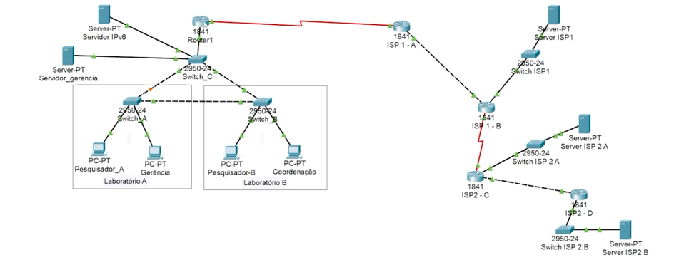

<h2>Roteamento externo</h2> 
<h3>Projeto inicial para o curso</h3>

Identificação de ASN sistemas autônomos precisam de um numero de identificação, no caso temos duas ASN, cada uma pode ser pensada como a area de responsabilidade de roteamento de um ISP.

<h3>Roteamento externo</h3>

O roteamento externo é a capacidade de ASNs falarem entre si, para isso é utilizado o protocolo BGP border gateway patrol. Basicamente serve para que redes ASN possa se comunicar entre si.
<h3>Transferência de rotas entre protocolos</h3>

Apos a comunicação ser estabelecida entre ASNs atraves do protocolo BGP, precisamos que essas informações seja redistribuidas pelo router de cada rede autonoma (ISP ou outras redes grandes o suficiente). Para isso precisamo fazer com que o BGP fale com os OSPF e RIPs que fazem o roteamento interno de uma ASN. Isso é feito cm alguns comandos que não decorei, mas tem haver com retransmissão ou algo do genero. 

<!-- 
Redistribuição de informações com o BGP
Faça como eu fiz: configurando o protocolo BGP
Hora da prática
O que aprendemos?
-->