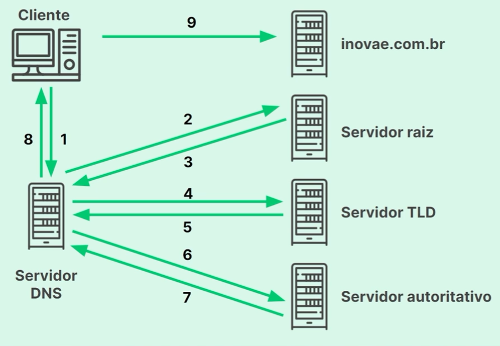

<h2>Sistemas de nomes de domínio (DNS)</h2> 

<h3>Configurando um servidor DNS</h3>

Configuramos um servidor DNS dentro de um dos ISPs, la que vai residir o software de gerenciamento DNS, o servoidor DNS não passa disso, um serviço dentro de um computador.

<h3>Função do servidor DNS</h3>

O DNS server é o tradutor de IPs, ele é responsavel por converter numeros de endereco IP em nomes de dominio para facilitar a leitura e memorização para humanos, ex: www.google.com, www.youtube.com, etc

<h3>Entendendo o sistema DNS</h3>

A resolução de um DNS tem vários passos caso o servidor DNS não tenha o endereço ainda em cache, nesse caso vai precisar sair perguntando para varios outros serivdores do sistema de DNS, cada qual tem uma parte do nome ou informações sobre quem tem, até chegar no servidor autoritativo, esse por sua vez é a fonte confiavel para nos fornecer o IP desse dominio que procuramos.

<!--
Acessando servidores web
Configurando uma rota padrão
Faça como eu fiz: configurando uma rota padrão na rede do Instituto Inovae
Resolução de nomes de domínio
Para saber mais: DNS - O que é, como funciona e qual escolher?
Faça como eu fiz: implementando servidores DNS
Hora da prática
O que aprendemos?
-->