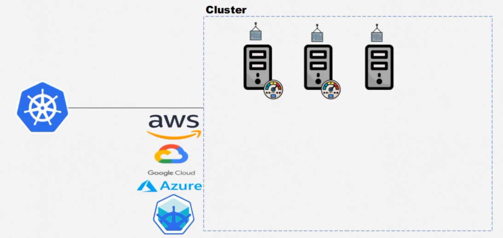

# Kubernetes: Pods, Services e ConfigMaps

1. Conhecendo o Kubernetes Ver primeiro vídeo
2. Criando o cluster
3. Criando e entendendo pods
4. Expondo pods com services
5. Aplicando services ao projeto
6. Definindo variáveis de ambiente


## 1. Conhecendo o Kubernetes Ver primeiro vídeo



Cluster, uma ou mais maquinas trablhando em um conjunto dividindo recursos.


## 2. Criando o cluster

hands on codigo

## 3. Criando e entendendo pods


- Pods são completamente efêmeros

``` shell
# cria pod com nginx inline (not normal)
kubectl run nginx-pod --image=nginx:latest

# observa em tempo real
kubectl get pods --watch

# display detalhes dos pods
kubectl describe pod nginx-pod

# edita pods
kubectl edit pod nginx-pod

# deleta um pod pelo nome
kubectl delete pod nginx-pod

# cria um pod definido em arquivo yaml
kubectl apply -f primeiro-pod.yaml 

# deleta o pod que foi definido nesse arquivo yaml
kubectl delete -f primeiro-pod.yaml 

#entra dentro do pod
kubectl exec -it portal-noticias -- bash

```
## 4. Expondo pods com services


5. Aplicando services ao projeto

hands on codigo

6. Definindo variáveis de ambiente

hands on codigo

