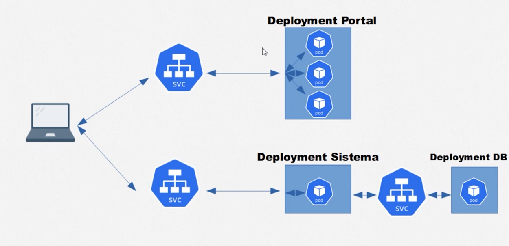
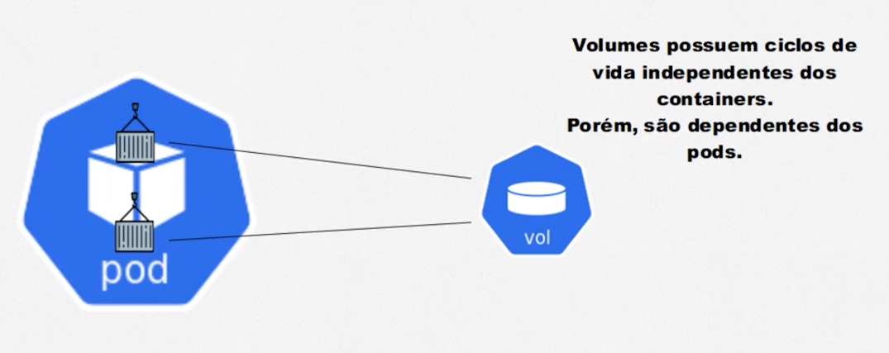
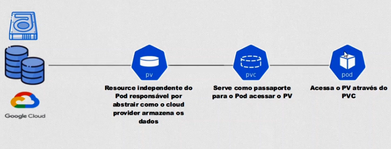
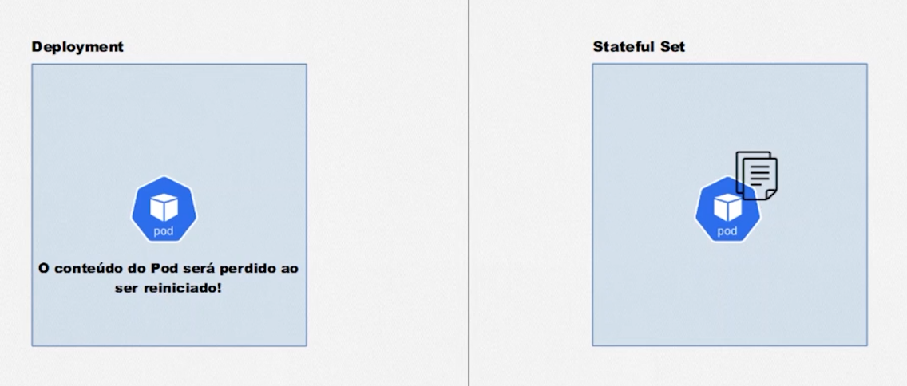
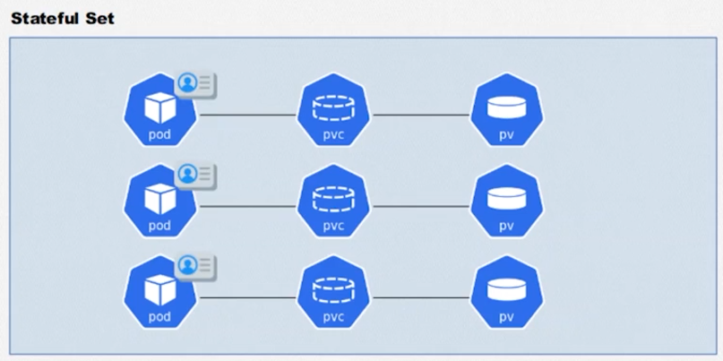
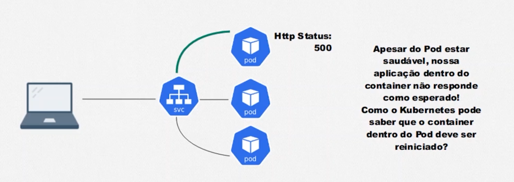

# Kubernetes: Deployments, Volumes e Escalabilidade

1. Conhecendo ReplicaSets e Deployments
2. Persistindo dados com o Kubernetes
3. Storage Classes e StatefulSets
4. Checando status com Probes
5. Como escalar com o Horizontal Pod Autoscaler

## 1. Conhecendo ReplicaSets e Deployments

## 2. Persistindo dados com o Kubernetes

## 3. Storage Classes e StatefulSets

## 4. Checando status com Probes

