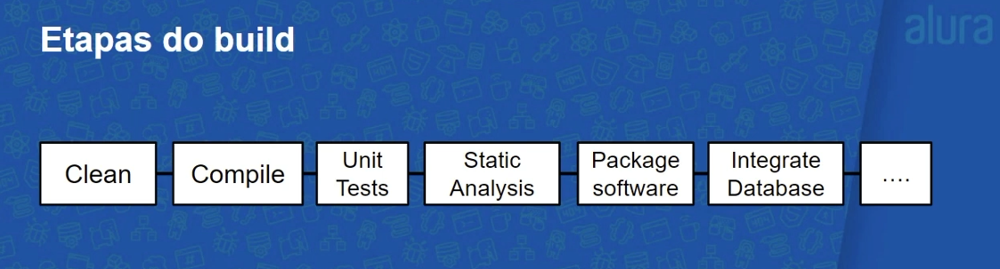
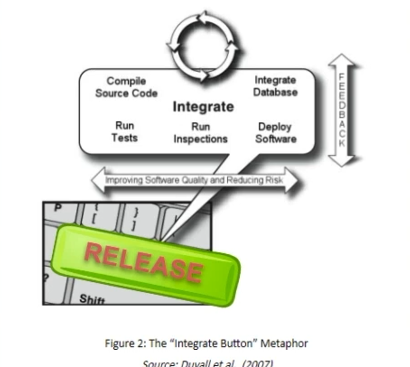
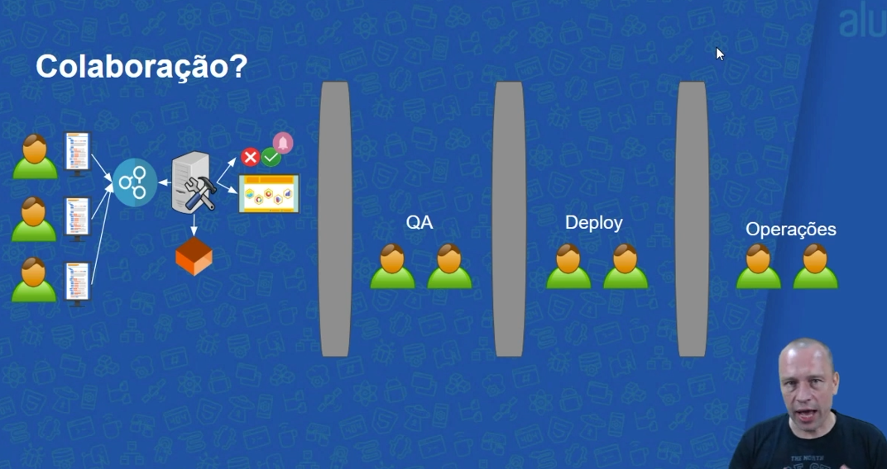

# Integração Contínua: mais qualidade e menos risco no desenvolvimento

<li>O que é integração contínua? Ver primeiro vídeo
<li>Estratégias de ramificação
<li>Builds e testes automatizados
<li>Mais feedback com builds contínuas
<li>Um pouco sobre a entrega contínua

