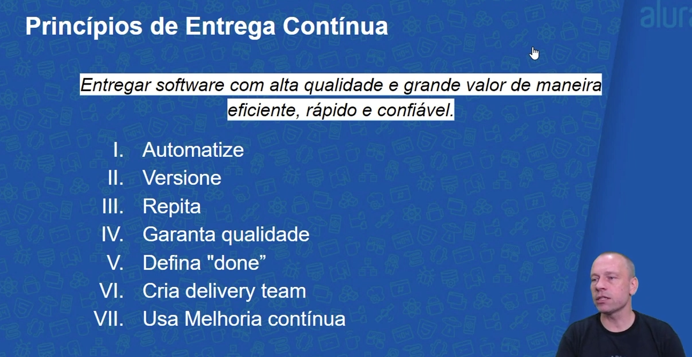
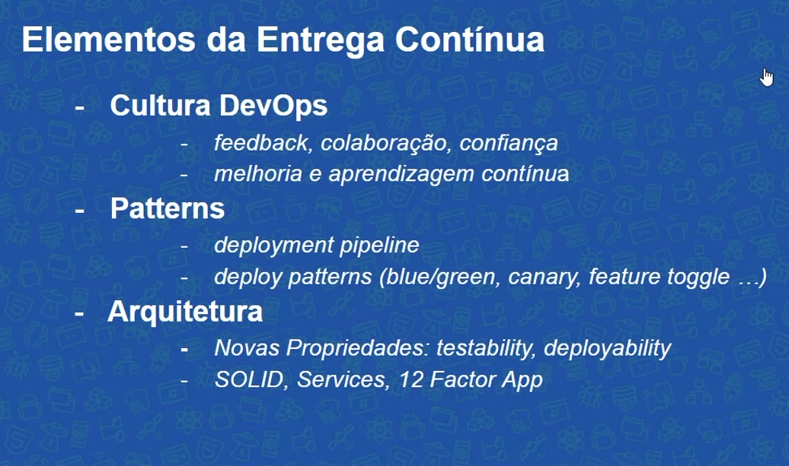
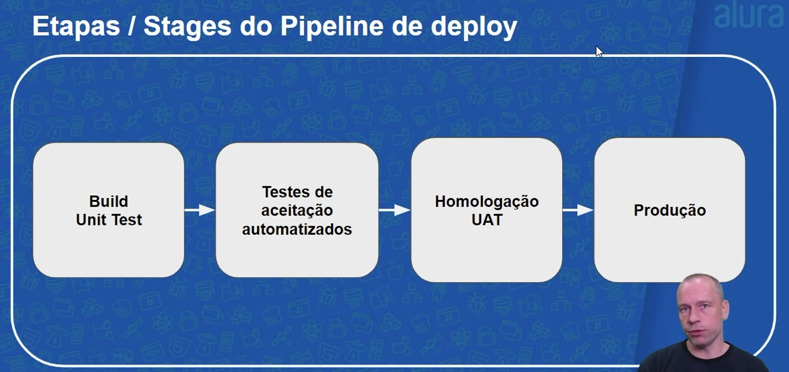
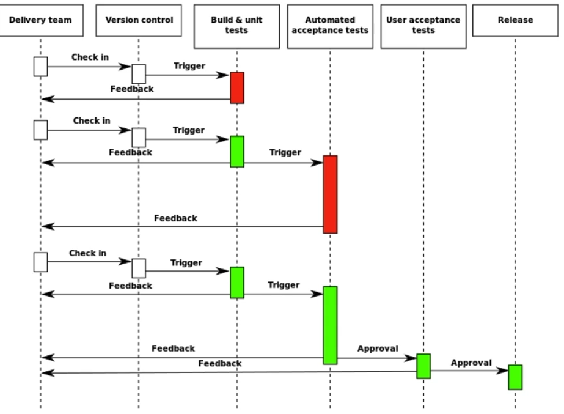
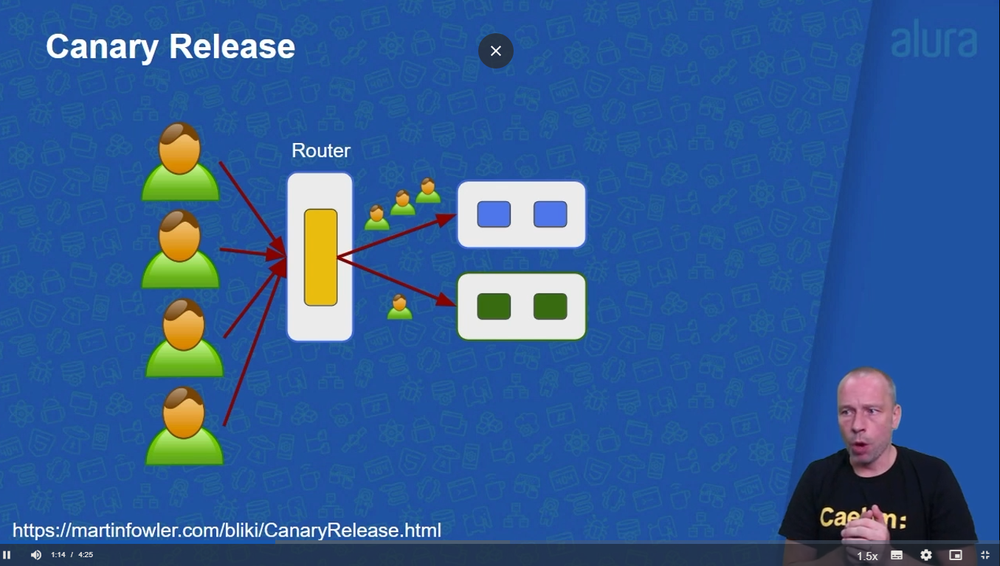

# Entrega Contínua: confiabilidade e qualidade na implantação de software
<li>O que é Entrega Contínua? Ver primeiro vídeo
<li>Fundamentos
<li>Deployment Pipeline
<li>Stage de commit e testes de aceitação
<li>Stage de Homologação
<li>Estratégias de releases

