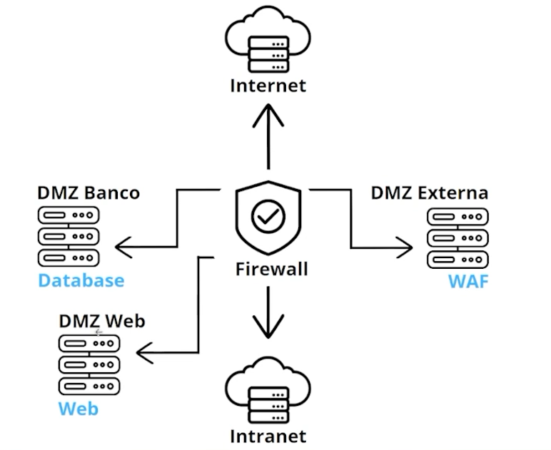
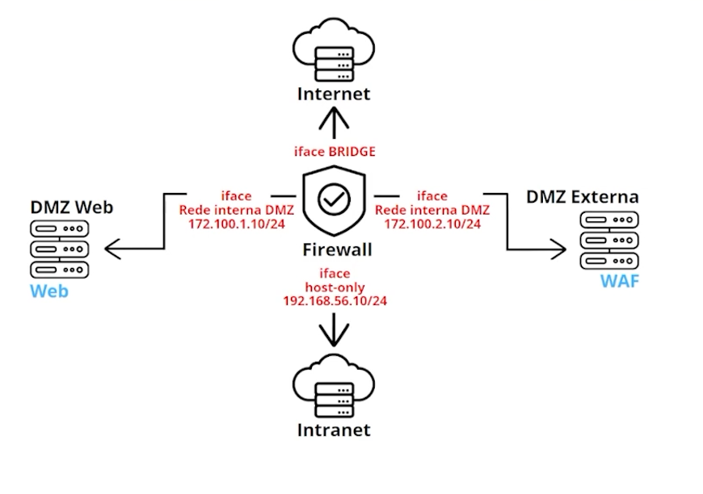
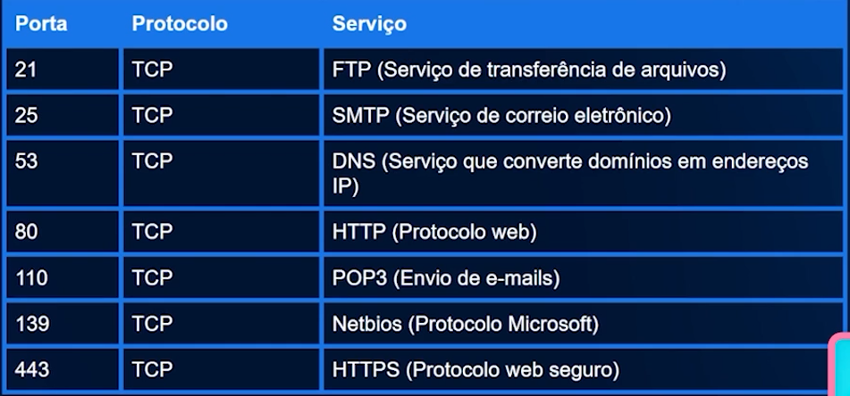

# Segurança de rede: firewall, WAF e SIEM

1. Fundamentos do Blue Team
2. Criando regras no Firewall
3. Logs com o pfSense
4. Logs com o Graylog
5. Pfsense com Snort

## 1. Fundamentos do Blue Team

## 2. Criando regras no Firewall

Para simplicar iremos usar apenas 1 servidor de produção, e deixar o servidor de bancos de dados para um proximo momento.

Linkedin post -> 

Falar das tecnologias utilizadas

**PfSense** - Faz o serviço de Firewall / Gateway / reverse proxy para nossa rede.
**Graylog** - gerencia os logs do Firewall (servidor rodando PfSense)
**Snort** - plgind para o graylog, funcionara como nosso IDS/IPS

***IDS*** - Intrusion Detection System  
***IPS*** - Intrusion Prevention System

**Sistema de detecção de intrusão baseado em host (HIDS)**  
Quando o IDS é baseado em host, ele é instalado em cada máquina que será monitorada. Isso é feito com a finalidade de analisar os eventos de logs e como última medida de defesa, ou seja, em caso de um ataque passar pelo firewall.

**Sistema de detecção de intrusão baseado em rede (NIDS)**  
Ao contrário do anterior, um IDS baseado em rede, monitora toda a rede. Ele analisa todo o tráfego de rede da interface em que está, combinando inspeções em protocolos e regras. Além disso, identifica ataques por meio de comportamentos anormais do tráfego.

*No caso do **Snort** utilizado no curso, ele se caracteriza como um NIDS.*