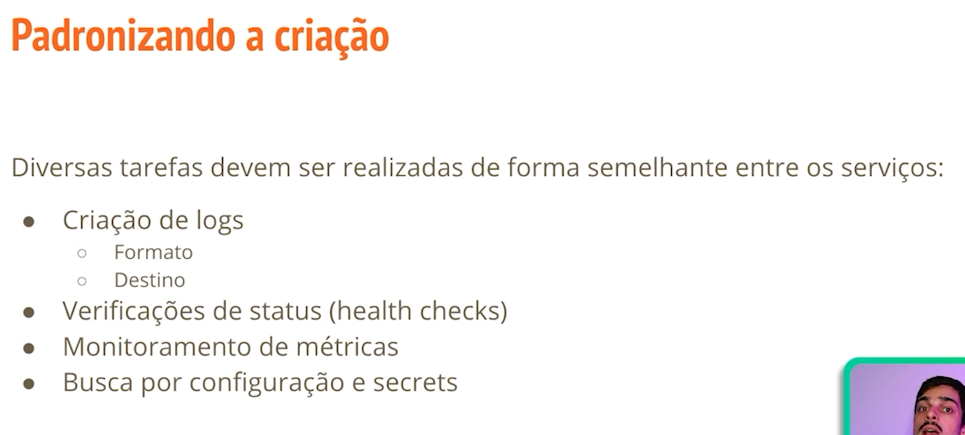

# Microsserviços: explorando os conceitos

- Arquitetando microsserviços
- Criação de serviços
- Como se comunicar
- Segurança de serviços
- Lidando com o deploy

## Arquitetando microsserviços

## Criação de serviços

## Como se comunicar

**Assincrona**

## Segurança de serviços

## Lidando com o deploy

