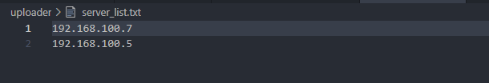

# Uploader


<p>Nome do script: <b>uploader.py</b>


<p>Script que envia o conteudo (todos os arquivo dentro) de um diretorio local para o servidor escolhido.

<h3> Command [ path destino ] [ path alvo ]</h3>

<li>[ path destino ] :  path para o diretorio que tera seu conteudo enviado
<li>[ path alvo ] :     path destino onde sera enviado o conteudo (se nao existir o scrip deve criar o diretorio)</li><br>


```
$ ./uploader.py /home/vidal/arquivos_para_enviar/ /home/remoto/arquivos_recebidos
```

<br>
<p><b>IMPORTANTE:</b> É necessário existir um arquivo chamado server_list.txt no mesmo diretorio de onde esta sendo rodado o script, esse arquivo contem a lista de todos os IPs dos servidores que receberão os arquivos.




<!--
Para criar o Cronjob:
```
$ crontab -e -->
